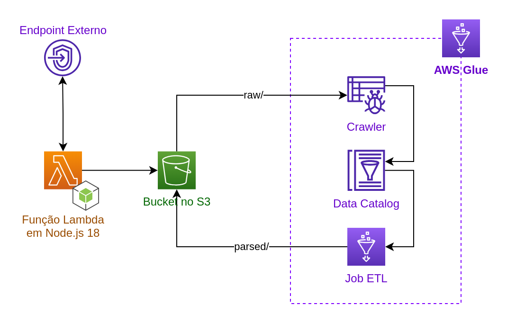
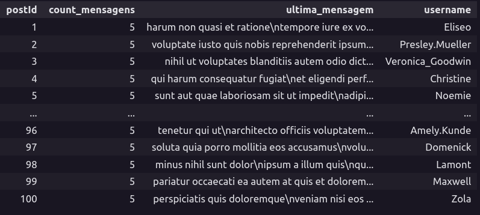

# POC - ETL usando Serviços AWS

Extração e transformação de dados usando AWS Lambda e AWS Glue.

---

## Requisitos

Afim de rodar o deploy da função, é necessário ter:

1. AWS CLI, configurado com credenciais com acessos requisitados pelo Serverless Framework.
2. Bucket no S3 criado para envio do JSON extraído.
3. Serverless Framework instalado via:

   ```bash
   npm install -g serverless
   ```

## Configuração e Deploy

1. Copiar o arquivo de configuração base e ajustar conforme necessidade.

   ```bash
   cp contrib/config_sample.json config.json
   ```

2. Rodar o comando de deploy.

   ```bash
   serverless deploy
   ```

## Especificações Técnicas

O sistema de ETL segue o seguinte fluxo:



- Uma função Lambda, escrita em Node, busca do endpoint especificado e envia o arquivo extraído para um bucket do S3;

- Um Crawler do AWS Glue mapeia os dados extraídos do JSON para um Data Catalog;

- Um processo de ETL executa a transformação, usando sintaxe do próprio PySpark, dentro de um Jupyter Notebook (disponível [aqui](notebooks/etl.ipynb)), e envia o resultado em CSV (particionado) novamente para o Bucket.

## Resultado da Extração

Após o processo de ETL, é possível reagrupar os arquivos CSV e visualizá-los utilizando alguma ferramenta, como outro Jupyter Notebook localmente, por exemplo. Podemos ver a seguinte saída de dados:



O notebook utilizado para essa tarefa pode ser encontrado [aqui](notebooks/show.ipynb).
